# Predict Rent Portugal

This repository contains a data collection project that focuses on gathering rental data from a popular house rental website in Portugal. The objective of this project is to apply best practices in MLOps, utilizing technologies such as XGBoost, Prefect, Evidently AI, mlflow, and FastAPI.

## Problem
Finding suitable rental properties in Portugal can be a time-consuming and challenging task. The rental market is vast and dynamic, making it difficult for individuals and businesses to estimate fair rental prices for different types of properties in various regions. Additionally, manually collecting and analyzing rental data from numerous sources can be tedious and error-prone.

To address these challenges, the Predict Rent Portugal aims to automate the data collection process from a specific house rental website. By leveraging web scraping techniques and machine learning algorithms, the project seeks to provide accurate and up-to-date rental price estimations, empowering users to make informed decisions about rental properties.

## Project Overview
The Predict Rent Portugal automates the process of collecting rental data from a popular house rental website in Portugal. By scraping the website, relevant information such as property details, location, and rental prices are collected and stored for further analysis. The project utilizes technologies such as XGBoost, Prefect, Evidently AI, Mlflow, FastAPI, Terraform and Docker to apply best practices in MLOps and ensure efficient data collection, modeling, monitoring, and real-time predictions.

## Technologies Used
The project utilizes the following technologies:

1. [XGBoost](https://xgboost.readthedocs.io/en/stable/): XGBoost is a powerful machine learning library known for its high-performance gradient boosting algorithms. It can be used for building predictive models based on the collected rental data.
2. [Prefect](https://www.prefect.io/): Prefect is an open-source workflow management system that allows for the creation and scheduling of data collection tasks. It provides a powerful infrastructure for orchestrating the data collection process, ensuring reliability and scalability.
3. [Evidently AI](https://www.evidentlyai.com/): Evidently AI is a Python library that enables model monitoring and validation. It allows for the analysis and visualization of model performance, ensuring the quality and reliability of the collected data and subsequent models.
4. [Mlflow](https://mlflow.org/): mlflow is an open-source platform for managing the machine learning lifecycle. It provides tools for tracking experiments, packaging code, and managing model deployments. In this project, mlflow is used to evaluate and compare different machine learning models' performance.
5. [FastAPI](https://fastapi.tiangolo.com/): FastAPI is a modern, fast (high-performance), web framework for building APIs with Python 3.7+ based on standard Python type hints. It can be used to develop a RESTful API to expose the collected data and provide real-time predictions.
6. [Grafana](https://grafana.com/): Grafana is a dynamic open-source platform that transforms data into visual stories. It connects various data sources, empowering users to create custom dashboards with graphs, charts, and tables.
7. [Terraform](https://www.terraform.io/): Terraform is a tool for creating and managing infrastructure using code, making it easier to set up and manage resources across various environments.
8. [Docker](https://www.docker.com/): Docker is a platform for packaging and running applications in isolated containers, ensuring consistent performance across different systems.
9. [Makefile](https://www.gnu.org/software/make/manual/make.html): is a set of instructions that automates compiling and building software projects. It defines how source code is transformed into executable programs, streamlining the development process and ensuring consistent results.

## Architecture
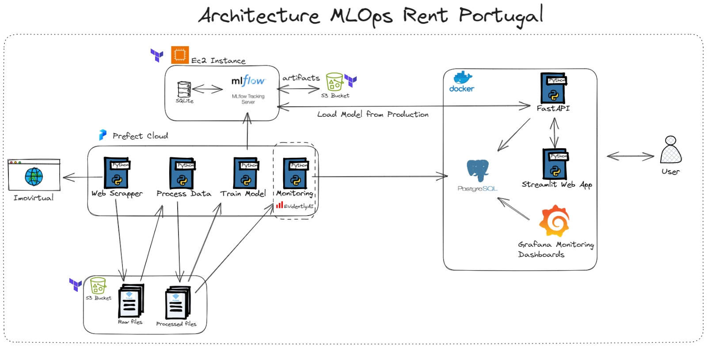

## Project Structure
The project follows a modular structure to separate different stages and functionalities.
```
mlops_final_project/
├── .env.sample                     # Sample environment file
├── .gitignore                      # Git configuration file for ignoring files
├── .pre-commit-config.yaml         # Pre-commit hooks configuration
├── .prefectignore                  # Prefect exclusion file
├── data/                           # Data directory
│   ├── processed/                  # Processed data
│   └── raw/                        # Raw data
├── deployment.yaml                 # Prefect deployment file
├── docker-compose.yaml             # Docker compose file
├── Dockerfile.api                  # Docker file for API
├── Dockerfile.web_app              # Docker file for web app
├── images/                         # Images directory
├── infrastructure/                 # Infrastructure code directory
│   ├── main.tf                     # Main Terraform file
│   ├── modules/                    # Terraform modules
│   │   ├── mlflow_ec2/             # MLflow EC2 instance module
│   │   ├── s3/                     # S3 bucket module
│   │   └── security_group/         # Security group module
│   ├── variables.tf                # Terraform variables
│   └── vars/                       # Specific variables
│       └── prod.tfvars             # Variables for production environment
├── Makefile                        # Make file for task automation
├── models/                         # Trained models directory
├── notebooks/                      # Notebooks directory
├── prefect.yaml                    # Prefect configuration file
├── pyproject.toml                  # Python project configuration file
├── README.md                       # Project README file
├── reports/                        # Reports directory
│   └── .gitkeep                    # File to keep directory empty in Git
├── requirements.txt                # Project dependencies list
├── requirements_dev.txt            # Development dependencies list
├── setup.py                        # Package installation configuration file
├── src/                            # Source code directory
│   ├── __init__.py                 # Package initialization file
│   ├── api/                        # API code
│   │   ├── __init__.py             # Package initialization file
│   │   └── main.py                 # FastAPI implementation
│   ├── entities/                   # System entity definitions
│   │   ├── __init__.py             # Package initialization file
│   │   ├── enums.py                # enums objects
│   │   └── models.py               # models objects
│   ├── generate_predicts.py        # Script to generate predictions
│   ├── monitoring/                 # Monitoring code
│   │   ├── __init__.py             # Package initialization file
│   │   └── monitoring.py           # Evidently AI implementation
│   ├── scrapper/                   # Data scraping code
│   │   ├── __init__.py             # Package initialization file
│   │   └── scrapper.py             # WebScrapper implementation
│   ├── training/                   # Model training code
│   │   ├── __init__.py             # Package initialization file
│   │   ├── preprocess.py           # Script to preprocess data from webscrapper
│   │   └── train.py                # Script to train model with processed data
│   ├── utils/                      # Various utilities
│   │   ├── __init__.py             # Package initialization file
│   │   ├── bucket_utils.py         # utilities for s3 bucket
│   │   └── predictions_utils.py    # utilities for data predictions
│   └── web_app/                    # Web app code
│       ├── __init__.py             # Package initialization file
│       └── web_app.py              # Streamlit implementation
└── tests/                          # Tests directory
    ├── __init__.py                 # Tests initialization file
    └── model_test.py
    # Tests for models
```

## <span style="color: red;">Attention:</span> Some assumptions that must be followed:

* This project uses some tools that must be installed in your operating system. Make sure they are properly installed.
* Python version: Python 3.9.12
* You must have an [AWS](https://aws.amazon.com/) account.
* You must have an [Prefect](https://www.prefect.io/) account.

If necessary, follow the download links below.

* [python-3.9.12](https://www.python.org/downloads/release/python-3912/)
* [makefile-download](https://gnuwin32.sourceforge.net/packages/make.htm)
* [terraform-download](https://developer.hashicorp.com/terraform/downloads)
* [docker-download](https://www.docker.com/products/docker-desktop/)
* [aws-cli](https://docs.aws.amazon.com/cli/latest/userguide/getting-started-install.html)

## How to use

* In your AWS account create a key_pair, or if you already have one, put the key name in the file, according to the image bellow (replace the value of key_name using you key_pair name):

path: **infrastructure/vars**
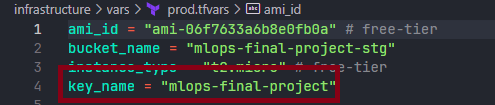


### To use this project, follow these steps:

1. Clone the repository
* Clone the repository that contains the project
    ```bash
    git clone https://github.com/marcosppaiva/mlops-final-project.git
    ```
2. Rename .env.sample file
* This command will rename the file from .env.sample to .env.
    ```bash
    make rename_env_file
    ```
* After executing the command, open the .env file and add your access key to the prefect cloud. If necessary, check the [prefect-documentation.](https://docs.prefect.io/2.11.3/cloud/users/api-keys/)

    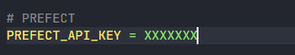

3. Create a virtual env and install requirements

* This command will create a virtualenv and after you need to activate your env and install the necessary dependencies for the project
    ```bash
    make venv-create

    # Windows user
    venv\Scripts\activate
    # Unix user
    source venv/Scripts/activate

    # Install dependencies
    make local-setup
    ```
4. Deploy into Prefect Cloud
* This command will deploy your flows into Prefect Cloud and creat a worker-pool
    ```bash
    # Make sure you set the access key in the .env file
    make prefect-cloud
    ```
* After executing this command the terminal is blocked since we have activated a worker-pool. Open another terminal to continue

5. Start mlflow on AWS Cloud
    ```bash
    make terraform-deploy
    ```
* After executing the command, anwser yes and open the .env file and add the ip address to the MLFLOW_TRACKING_URI (copy the public_ip_ec2 from the output terminal)

* Output terminal

    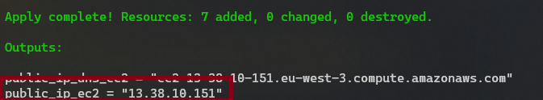

* .env file

    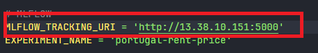

6. Run Docker
    ```bash
    make docker-run
    ```

## Services
| Serviço   | IP de Acesso     |
|:----------|:-----------------|
| web-app   | http://localhost:8501/ |
| API       | http://localhost:8000/docs |
| grafana   | http://localhost:3000/ |
| pgAdmin   | http://localhost:16543/ |
| mlflow    | Same IP from env config |

## Simulating the Operation
```bash
make execute-all-pipeline
```

## MLFLOW

### Experiments

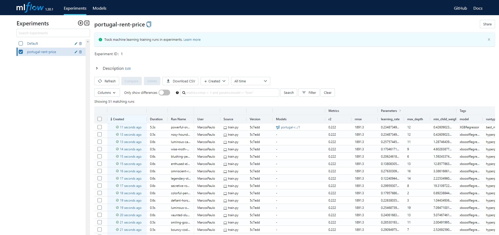

### Models
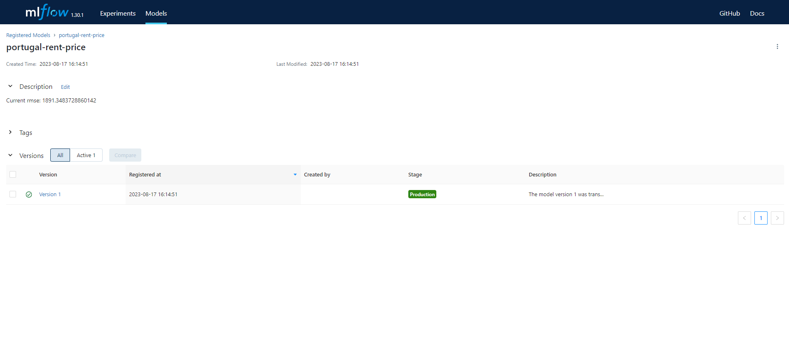

## Prefect Cloud
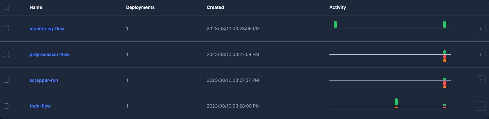

## API
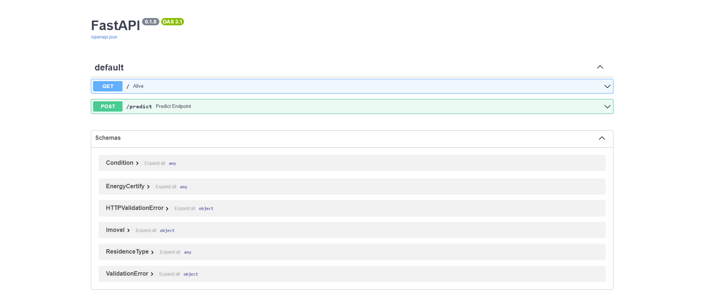

## Monitoring-Grafana
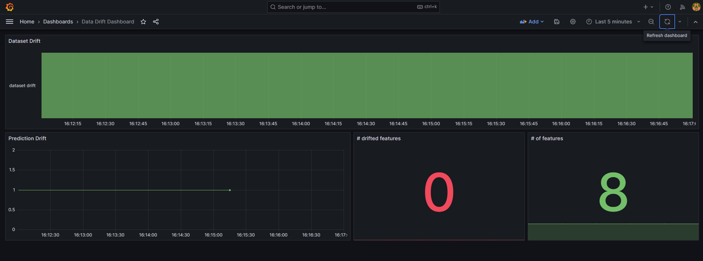

## Web-App
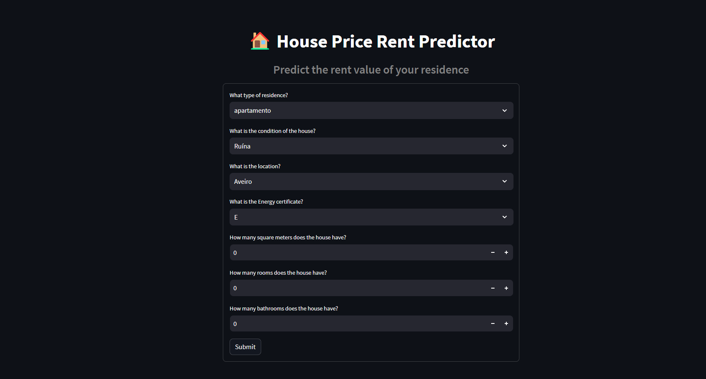


## Best Practices

- ✅ Testing: unit
- ❌ Testing: integration
- ✅ Python: linting and formatting
- ✅ Pre-commit hooks and makefiles
- ❌ CI/CD (GitHub Actions)
- ✅ Infrastructure as code (Terraform)

## To Improve
- Create integration tests
- Create a structure to save data incrementally in web scraper
- Implements CI/CD
- improve model performance
- deploy all project into cloud
